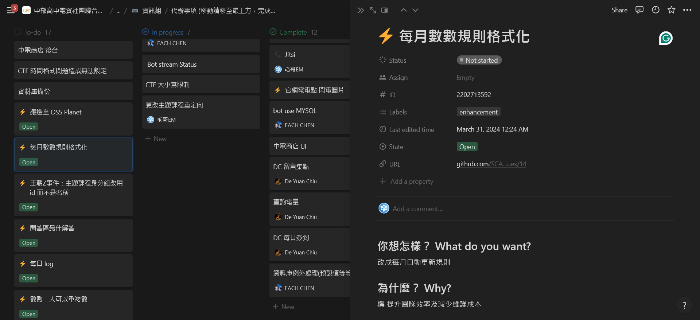

# GitHub-issue-2-Notion
A simple tool to sync GitHub issues to Notion beautifully  
一個簡單的工具，將 GitHub 的 issue 優雅的同步到 Notion


## Usage


1. Create a new integration in [Notion](https://www.notion.so/my-integrations/) and get the token
2. Copy database ID from the URL of the database
   - For example: `https://www.notion.so/myworkspace/Database-1234567890abcdef1234567890abcdef`
   - `1234567890abcdef1234567890abcdef` is the database ID
1. Set three GitHub secrets in the repository settings
   - `NOTION_API_KEY`: The token of the Notion integration
   - `NOTION_DATABASE_ID`: The ID of the Notion database
   - `GITHUB_REPO`: The owner and name of the GitHub repository
     - For example: `SCAICT/SCAICT_uwu`
4. Create a workflow file in the repository
   - For example: `.github/workflows/sync.yml`
   - The content of the file should be like this:

```yaml
name: Sync issues to Notion

on:
  issues:
    types: [opened, edited, deleted, reopened, closed]
  workflow_dispatch:
jobs:
  sync:
    runs-on: ubuntu-latest
    steps:
      - name: Notion GitHub Issues Automation
        uses: Edit-Mr/GitHub-issue-2-Notion@main
        with:
            repo: ${{ github.repository }} 
            NOTION_API_KEY: ${{ secrets.NOTION_API_KEY }}
            NOTION_DATABASE: ${{ secrets.NOTION_DATABASE_ID }}
```
